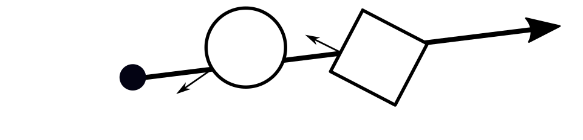

#  Physics Based Ray Tracing in Go


## Introduction

In this series of blog posts I explain the inner workings of [BruteRay](http://github.com/barnex/bruteray), a physics-based ray tracer written in Go.

First and foremost, BruteRay focuses on **simplicity**. I chose the name because initially I assumed that this would make it rather slow and "brute force".

However, the simple design (combined with Go's excellent profiling and generally good performance) eventually led to a surprisingly fast implementation. In fact, the speed seems to be in the same  ballpark as  well-established tracers like _PovRay_.

The image below, for instance, was rendered on a laptop in only a few minutes.

 
*Damaliscus Korrigum skull (3D model with 300,000 faces) from [artec3d.com](http://www.artec3d.com). Sand heightmap drawn in GIMP. Ray traced in Go.*

It did take several thousand lines of code before I was able to render that skull with photorealistic quality. But ray tracing is actually quite accessible. In fact, a simpler image like the one below can be achieved with just a few hundred lines of straightforward code.


*Spheres like this can be ray traced with just a few hundred lines of code.*

In what follows I'll try to start from the basics needed to render the above spheres, and continue all the way to the techniques needed to render the Damaliscus Korrigum skull I showed earlier. 

Rather than dwelling on the basic theory, which is better explained [elsewhere](https://en.wikipedia.org/wiki/Ray_tracing_(graphics)), I'll focus on the design in Go. Although I'm borrowing naming from, e.g., [pbrt](http://www.pbr-book.org/), the design presented here is distinctly "Go" and does not attempt to copy the design of various C++ ray tracers. In particular, BruteRay is composed of narrow, often single-method, interfaces that each perform a single, well-defined function. This is a very different style from many C++ ray tracers.

## Basics

### Geometric primitives

First, we need some basic building blocks like a 3-component vector [`Vec`](https://godoc.org/github.com/barnex/bruteray/geom#Vec), a floating-point [`Color`](https://godoc.org/github.com/barnex/bruteray/color#Color) implementation, and of course the [`Ray`](https://godoc.org/github.com/barnex/bruteray/tracer#Ray). A `Ray` is an infinitely long half-line with origin `Start` and direction `Dir` (a unit vector). Positions along the ray are denoted by `t`, with `t=0` being the starting point. Refer to the [godoc](https://godoc.org/github.com/barnex/bruteray/) for more details.


*A Ray has a starting point and direction. Distances along the Ray are denoted by `t`.*


### Camera, Object, Material

In ray tracing we follow the light backwards. A ray starts from a pixel in the camera, travels out of the lens, bounces around the scene, and eventually ends at a light source (we'll refine this into a bi-directional method later on). 

Thus when we speak of a ray, think of it as a _line of sight_. Fortunately, the laws of optics remain the same if we reverse the light's direction. So we generally don't need to worry about this. 

Our process for finding a pixel's color consists of 3 steps.

**1** The **Camera** constructs a Ray starting from a certain pixel position (u,v), pointing into the scene. A camera is anything that can turn a pixel position into a `Ray`:

```go
type Camera interface{
	// RayFrom constructs a Ray starting from pixel position (u, v) in the unit square.
	RayFrom(u, v float64) *Ray
}
```

**2** We test for **intersection** between the ray and all objects in our scene. An Object is anything that can be rendered, like a blue sphere. All an `Object` needs to do is be able to find its intersection with a `Ray`:

```go
type Object interface{
	// Intersect returns a non-zero HitRecord if the Ray intersects the Object.
	// The HitRecord records the position, surface normal and matrial of the intersection.
	Intersect(r *Ray)HitRecord
}
```
If the ray actually intersects the object, then `Intersect` returns a non-zero `HitRecord`. The HitRecord stores information about the intersection point: its postion `T` along the ray, the object's surface [normal](https://en.wikipedia.org/wiki/Normal_(geometry)) at the intersection point, and the object's material:

```go
type HitRecord struct{
	T        float64
	Normal   Vec
	Material Material
}
```

The `HitRecord` contains all the information we need to eventually find the pixel's color. But we only do this for the frontmost `HitRecord` (the one with the smallest positive `T` value). The other intersections points are occluded, and we don't want to waste time evaluation their color if we're only going to throw it away.


*Each Object intersected by a Ray returns a HitRecord, recording the position, surface normal, and material at the intersection point. Here, the cube's HitRecord is occluded by the sphere, it will not be used further.*


**3** Now that we have the frontmost `Hitrecord`, we can finally evaluate its color. This is done by evaulating the `HitRecord`'s `Material`.

```go
type Material interface{
	Eval(ctx *Ctx, s *Scene, r *Ray, h HitCoords) Color
}
```

Evaluating a `Material`'s color is a recursive procedure. It may involve casting new rays (e.g. reflected with respect to the incoming ray), evaluating their color, and so on. If this recursion does not spontaneously end (e.g. by hitting a non-recursive material like a light source), then we need to artificially limit it to a maximum depth referred to as `RecursionDepth`.

That is really all there is to the ray tracing algorithm. All that is left to do is provide some concrete implementations of the single-method interfaces `Camera`, `Object` and `Material`.
