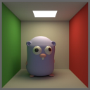
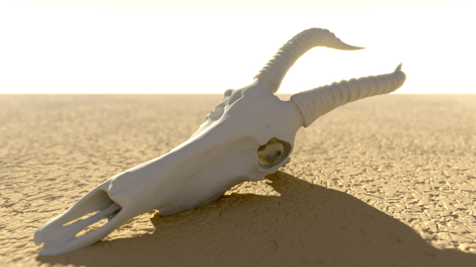
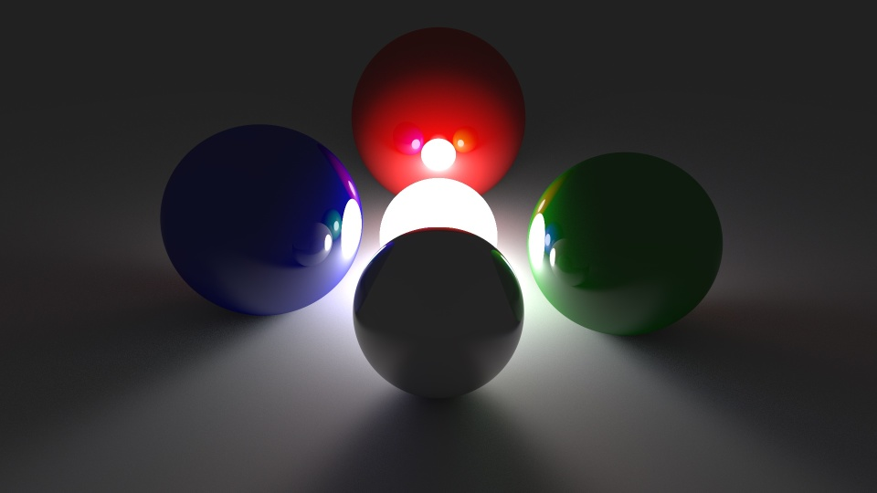
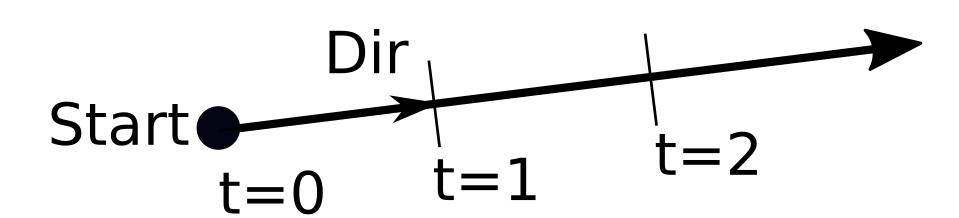
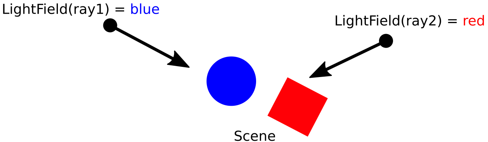
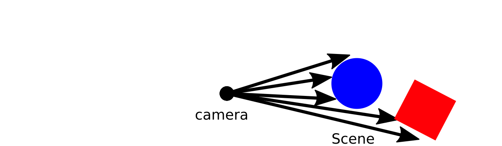

#  Physics Based Ray Tracing in Go


## Introduction

In this series of blog posts I explain the inner workings of [BruteRay](http://github.com/barnex/bruteray), a physics-based ray tracer written in Go.

BruteRay focuses on simplicity. I chose the name because I assumed that its simplicity would mean it had to be "brute force" and slow. However, the simple design eventually led to a surprisingly fast result. In fact, the speed seems to be in the same  ballpark as  tracers like [PovRay](http://www.povray.org/). The image below, for instance, was rendered on a laptop in just a few minutes.

 
*Damaliscus Korrigum skull (3D model with 300,000 faces, from [artec3d.com](http://www.artec3d.com)). Sand heightmap drawn in GIMP. Ray traced in Go.*

It took thousands of lines of code to render that skull. But a simpler image like the one below can be achieved with just a few hundred lines of code.


*Spheres like this can be ray traced with just a few hundred lines of code, but it does get trickier from there.*

In what follows I'll start from the basics needed to render some reflective spheres, and continue all the way to the techniques needed to render the Damaliscus Korrigum skull I showed earlier. 

Although I borrowed some naming from [PovRay](http://www.povray.org/) and [pbrt](http://www.pbr-book.org/), the design presented here does *not* attempt translate these C++ implementations to Go. On the contrary, rather than constructing a hierarchy of classes, the design composes simple interfaces (often with just a single method) into a more powerful whole.

---

## Part 0: Primitives
**2019-11-24**

Before we can start tracing rays, we need some basic building blocks like a 3-component vector:

```go
type Vec [3] float64
```
A `Vec` can represent either a point in 3D space, or a displacement (vector).

The corresponding linear algebra methods (sum, dot product,...) are implemented in package [geom](https://godoc.org/github.com/barnex/bruteray/geom). These methods operate on values rather pointers, so that we don't need to worry about mutability (or small allocations, for that matter).

Of course, we also need a [`Ray`](https://godoc.org/github.com/barnex/bruteray/tracer#Ray). A `Ray` is an infinitely long half-line with origin `Start` and direction `Dir` (a unit vector). 

```go
type Ray struct{
	Start, Dir Vec
}
```

Positions along the ray are denoted by `t`, with `t=0` being the starting point. We can find the point at position `t` like this:

```go
// At returns the point at distance t from the ray's start.
func (r *Ray) At(t float64) Vec{
	return r.Start.Add(r.Dir.Mul(t))
}
```


*A ray has a starting point and direction (unit vector). Distances along the Ray are denoted by `t`. Points with negative `t` are not considered to lie on the ray*

Some other geometric primitives that we'll need later on are a 3x3 [Matrix](https://godoc.org/github.com/barnex/bruteray/geom#Matrix), an [Affine Transformation](https://godoc.org/github.com/barnex/bruteray/geom#AffineTransform), etc. You can refer to the [godoc](https://godoc.org/github.com/barnex/bruteray/geom) documentation for those.


---

## [Part 1](#basics): Ray tracing basics
**2019-11-25**

If you're completely new to ray tracing, you might want to familiarize yourself with the concept [here](https://en.wikipedia.org/wiki/Ray_tracing_(graphics)).


In a perhaps unusual approach, I define the ray tracing algorithm simply as:

```
Image = LightField(Camera)
```

which reads: *To calculate an Image, evaluate the Light Field at the Camera*.

In what follows, I will explain what that means, and break down concepts like `LightField` into simpler,  building blocks like `Object` and `Material`. These will be broken down further until the entire algorithm has been explained.

But we'll start from the top by explaining the concepts Light Field and Camera.


### The Light Field

The Light Field of a scene is a function that gives us the light's brightness, seen from any given viewpoint and direction. The viewpoint and direction are, of course, represented by a `Ray`:

I.e., if our eye was positioned at a ray's start and we looked along the ray's direction, then we would see the color returned by the light field.


*The light field of a scene encodes the color seen by any given ray.*

In Go this can be expressed as:

```go
// A LightField returns the brightness seen along a ray
type LightField func(Ray) Color
```

We'll explain how to calculate the Light Field later on.

### The Camera

When a camera records an image, it captures a portion of the scene's light field and projects it onto a two-dimensional image. E.g., a 1-megapixel camera looks along 1 million rays, one per pixel, and captures the brightness of each of them.


*A camera records an image by capturing the brightness of one ray for every pixel.*

So a `Camera`'s job is to convert a pixel position to a ray. We can express this in Go as:

```go
type Camera interface{
	// RayFrom constructs a ray
	// starting from pixel position (u,v).
	RayFrom(u, v float64) Ray
}
```

### Conclusion

We have broken down the ray tracing algorithm in two independent parts: the Camera implementation, and calculating a Light Field. Once we have implemented both, we can find an image's color at pixel position (u,v) as:

```go
LightField(camera.RayFrom(u,v))
```

---

## Part 2: Cameras

In [Part 1](#basics)